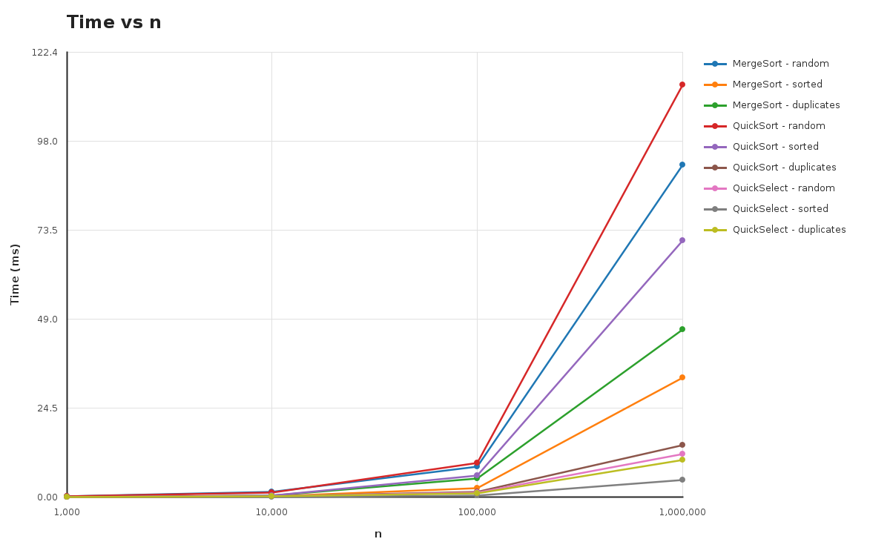
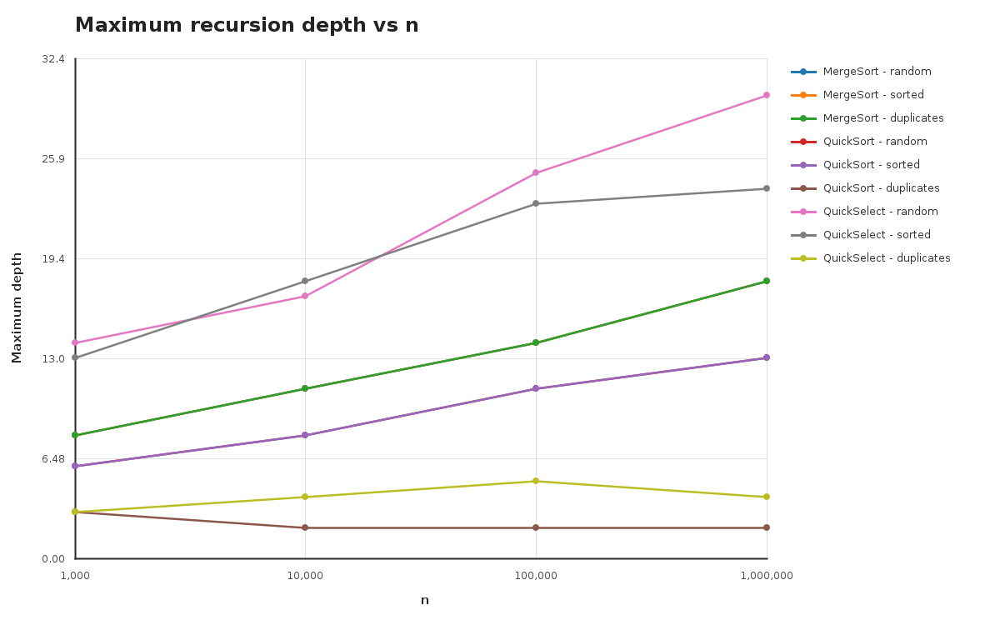
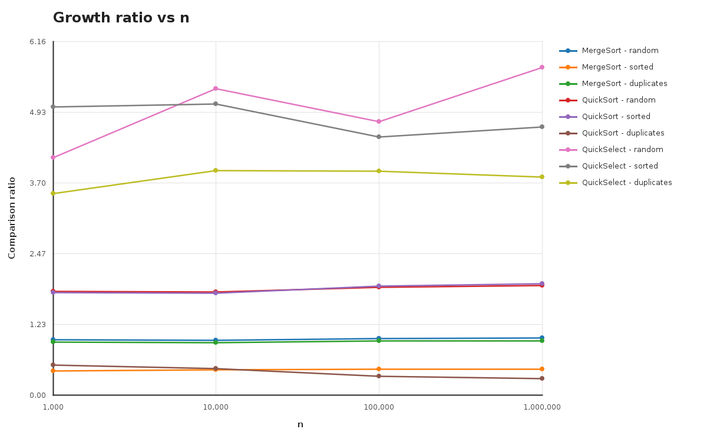

# Assignment 1 Report

**Student:** Alua Rakhimzhanova  
**Group:** SE-2509

## 1. Introduction

In this assignment I implemented MergeSort, QuickSort and QuickSelect for integer arrays. I also created a Metrics class to count comparisons, recursion depth and execution time.

MergeSort uses one temporary array for all merge operations. For parts with 15 or fewer elements, it uses Insertion Sort. QuickSort uses a random pivot and 3-way partition. It calls recursion only for the smaller part and processes the larger part in a loop. QuickSelect uses the same partition, but continues only in the part where index `k` is located.

## 2. Asymptotic analysis

| Algorithm | Best case | Average case | Worst case |
|---|---|---|---|
| MergeSort | Θ(n log n), because all levels are still merged | Θ(n log n), because the array is divided into two halves | Θ(n log n), because input order does not change the number of levels |
| QuickSort | Θ(n), when all values are equal and 3-way partition finishes in one step | Θ(n log n), because random pivots usually make reasonable parts | Θ(n²), when pivots repeatedly create very unequal parts |
| QuickSelect | Θ(n), when `k` is in the equal part after the first partition | Θ(n), because only one side is processed | Θ(n²), when every next part has size n - 1 |
| Insertion Sort | Θ(n), for an already sorted array | Θ(n²), for a random array | Θ(n²), for a reverse sorted array |

Big-O shows an upper bound. Big-Omega shows a lower bound. Big-Theta means that both bounds have the same growth rate. I used Theta in the table because the bounds are tight for the described cases.

## 3. Recurrence relations

### MergeSort

MergeSort divides the array into two equal parts and uses linear time to merge them.

`T(n) = 2T(n/2) + Θ(n)`

- `a = 2`
- `b = 2`
- `f(n) = Θ(n)`

Here, `n^(log_b(a)) = n`. This is Case 2 of the Master Theorem, so the result is `Θ(n log n)`.

### QuickSort

For a balanced partition, QuickSort has the same recurrence:

`T(n) = 2T(n/2) + Θ(n)`

- `a = 2`
- `b = 2`
- `f(n) = Θ(n)`

This is also Case 2, and the result is `Θ(n log n)`. A random pivot does not always divide the array exactly in half. However, it gives `O(n log n)` expected time because all pivot positions have the same chance.

### QuickSelect

QuickSelect continues only in one part:

`T(n) = T(n/2) + Θ(n)`

- `a = 1`
- `b = 2`
- `f(n) = Θ(n)`

Here, `n^(log_b(a)) = 1`, while `f(n) = n`. This is Case 3 of the Master Theorem, so the result is `Θ(n)`.

### Insertion Sort

Insertion Sort does not divide the array into equal parts, so the Master Theorem cannot be used for it. In the best case its recurrence is `T(n) = T(n - 1) + Θ(1)`, which gives `Θ(n)`. In the average and worst cases it is `T(n) = T(n - 1) + Θ(n)`, which gives `Θ(n²)`.

## 4. Benchmark

I tested sizes 1,000, 10,000, 100,000 and 1,000,000. I used three input types:

- `random`: random integer values;
- `sorted`: values from 0 to n - 1;
- `duplicates`: random values from 0 to 9.

Every case was executed five times. The program saved the median result to `results.csv`. Input creation and array copying were done before the timer started.

These are the results for `n = 1,000,000`:

| Algorithm | Input | Time (ms) | Comparisons | Max depth |
|---|---:|---:|---:|---:|
| MergeSort | random | 91.385 | 19,886,370 | 18 |
| MergeSort | sorted | 32.925 | 9,071,040 | 18 |
| MergeSort | duplicates | 46.221 | 18,926,322 | 18 |
| QuickSort | random | 113.372 | 38,142,916 | 13 |
| QuickSort | sorted | 70.537 | 38,710,999 | 13 |
| QuickSort | duplicates | 14.379 | 5,797,035 | 2 |
| QuickSelect | random | 11.870 | 5,706,570 | 30 |
| QuickSelect | sorted | 4.637 | 4,670,435 | 24 |
| QuickSelect | duplicates | 10.105 | 3,800,162 | 4 |

## 5. Plots

For MergeSort and QuickSort, the ratio is `comparisons / (n log2(n))`. For QuickSelect, it is `comparisons / n`.

## 6. Theta check

For MergeSort and `n >= 100,000`, the ratio is between about 0.44 and 1.00. I can use `c1 = 0.44`, `c2 = 1.00` and `n0 = 100,000`.

For QuickSort on random and sorted inputs, the ratio is between about 1.87 and 1.95. I can use `c1 = 1.87`, `c2 = 1.95` and `n0 = 100,000`. For duplicate values, the ratio becomes smaller because 3-way partition processes equal values together. This case is close to linear time.

For QuickSelect, `comparisons / n` is between about 3.80 and 5.71 for `n >= 100,000`. I can use `c1 = 3.80`, `c2 = 5.71` and `n0 = 100,000`. The values are not exactly the same because the pivot is random.

## 7. Discussion

The benchmark results are mostly similar to the theory. MergeSort shows `Θ(n log n)` growth and its recursion depth grows slowly. QuickSort also has close to `Θ(n log n)` results for random and sorted inputs. A sorted array does not create the worst case because the pivot is random. QuickSort is especially fast for duplicate values because of 3-way partition. QuickSelect is faster when I only need one position instead of the fully sorted array. Small results can change because of JVM warm-up, timer accuracy, Garbage Collector and CPU cache. The cutoff of 15 reduces the cost of MergeSort on small parts but does not change its asymptotic complexity.
